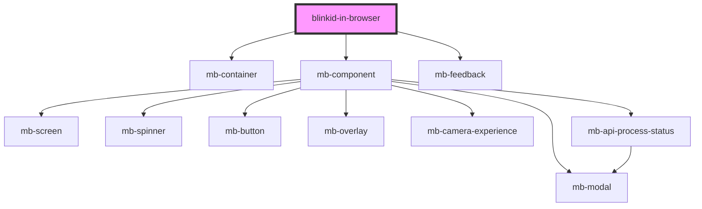

# blinkid-in-browser


<!-- Auto Generated Below -->


## Properties

| Property                           | Attribute                              | Description                                                                                                                                                                                                                                                                                                                                                                                                                                                                                                                                                                                                                                                     | Type                         | Default        |
| ---------------------------------- | -------------------------------------- | --------------------------------------------------------------------------------------------------------------------------------------------------------------------------------------------------------------------------------------------------------------------------------------------------------------------------------------------------------------------------------------------------------------------------------------------------------------------------------------------------------------------------------------------------------------------------------------------------------------------------------------------------------------- | ---------------------------- | -------------- |
| `allowHelloMessage`                | `allow-hello-message`                  | Write a hello message to the browser console when license check is successfully performed.  Hello message will contain the name and version of the SDK, which are required information for all support tickets.  Default value is true.                                                                                                                                                                                                                                                                                                                                                                                                                         | `boolean`                    | `true`         |
| `anonymization`                    | `anonymization`                        | Whether sensitive data should be removed from images, result fields or both.  The setting only applies to certain documents.  Default value is AnonymizationMode.FullResult which means that certain documents are anonymizied by default!  For more information see `src/Recognizers/BlinkID/Generic/AnonymizationMode.ts` file.                                                                                                                                                                                                                                                                                                                               | `string`                     | `"FullResult"` |
| `cameraId`                         | `camera-id`                            | Camera device ID passed from root component.  Client can choose which camera to turn on if array of cameras exists.                                                                                                                                                                                                                                                                                                                                                                                                                                                                                                                                             | `string`                     | `null`         |
| `enableDrag`                       | `enable-drag`                          | Set to 'false' if component should not enable drag and drop functionality.  Default value is 'true'.                                                                                                                                                                                                                                                                                                                                                                                                                                                                                                                                                            | `boolean`                    | `true`         |
| `engineLocation`                   | `engine-location`                      | Absolute location of WASM and related JS/data files. Useful when resource files should be loaded over CDN, or when web frameworks/libraries are used which store resources in specific locations, e.g. inside "assets" folder.  Important: if engine is hosted on another origin, CORS must be enabled between two hosts. That is, server where engine is hosted must have 'Access-Control-Allow-Origin' header for the location of the web app.  Important: SDK and WASM resources must be from the same version of package.  Default value is empty string, i.e. "". In case of empty string, value of "window.location.origin" property is going to be used. | `string`                     | `''`           |
| `hideFeedback`                     | `hide-feedback`                        | If set to 'true', UI component will not display feedback, i.e. information and error messages.  Setting this attribute to 'false' won't disable 'scanError' and 'scanInfo' events.  Default value is 'false'.                                                                                                                                                                                                                                                                                                                                                                                                                                                   | `boolean`                    | `false`        |
| `hideLoadingAndErrorUi`            | `hide-loading-and-error-ui`            | If set to 'true', UI component will become visible after successful SDK initialization. Also, error screen is not going to be displayed in case of initialization error.  If set to 'false', loading and error screens of the UI component will be visible during initialization and in case of an error.  Default value is 'false'.                                                                                                                                                                                                                                                                                                                            | `boolean`                    | `false`        |
| `iconCameraActive`                 | `icon-camera-active`                   | Hover state of iconCameraDefault.                                                                                                                                                                                                                                                                                                                                                                                                                                                                                                                                                                                                                               | `string`                     | `undefined`    |
| `iconCameraDefault`                | `icon-camera-default`                  | Provide alternative camera icon.  Every value that is placed here is passed as a value of `src` attribute to  element. This attribute can be used to provide location, base64 or any URL of alternative camera icon.  Image is scaled to 20x20 pixels.                                                                                                                                                                                                                                                                                                                                                                                                     | `string`                     | `undefined`    |
| `iconGalleryActive`                | `icon-gallery-active`                  | Hover state of iconGalleryDefault.                                                                                                                                                                                                                                                                                                                                                                                                                                                                                                                                                                                                                              | `string`                     | `undefined`    |
| `iconGalleryDefault`               | `icon-gallery-default`                 | Provide alternative gallery icon. This icon is also used during drag and drop action.  Every value that is placed here is passed as a value of `src` attribute to  element. This attribute can be used to provide location, base64 or any URL of alternative gallery icon.  Image is scaled to 20x20 pixels. In drag and drop dialog image is scaled to 24x24 pixels.                                                                                                                                                                                                                                                                                      | `string`                     | `undefined`    |
| `iconInvalidFormat`                | `icon-invalid-format`                  | Provide alternative invalid format icon which is used during drag and drop action.  Every value that is placed here is passed as a value of `src` attribute to  element. This attribute can be used to provide location, base64 or any URL of alternative gallery icon.  Image is scaled to 24x24 pixels.                                                                                                                                                                                                                                                                                                                                                  | `string`                     | `undefined`    |
| `iconSpinnerFromGalleryExperience` | `icon-spinner-from-gallery-experience` | Provide alternative loading icon. CSS rotation is applied to this icon.  Every value that is placed here is passed as a value of `src` attribute to  element. This attribute can be used to provide location, base64 or any URL of alternative gallery icon.  Image is scaled to 24x24 pixels.                                                                                                                                                                                                                                                                                                                                                             | `string`                     | `undefined`    |
| `iconSpinnerScreenLoading`         | `icon-spinner-screen-loading`          | Provide alternative loading icon. CSS rotation is applied to this icon.  Every value that is placed here is passed as a value of `src` attribute to  element. This attribute can be used to provide location, base64 or any URL of alternative gallery icon.  Image is scaled to 24x24 pixels.                                                                                                                                                                                                                                                                                                                                                             | `string`                     | `undefined`    |
| `includeSuccessFrame`              | `include-success-frame`                | Set to 'true' if success frame should be included in final scanning results.  Default value is 'false'.                                                                                                                                                                                                                                                                                                                                                                                                                                                                                                                                                         | `boolean`                    | `false`        |
| `licenseKey`                       | `license-key`                          | License key which is going to be used to unlock WASM library.  Keep in mind that UI component will reinitialize every time license key is changed.                                                                                                                                                                                                                                                                                                                                                                                                                                                                                                              | `string`                     | `undefined`    |
| `rawRecognizerOptions`             | `recognizer-options`                   | Specify additional recognizer options.  For a full list of available recognizer options see source code of a recognizer. For example, list of available recognizer options for BlinkIdRecognizer can be seen in the `src/Recognizers/BlinkID/Generic/BlinkIdRecognizer.ts` file.  Example:  `<blinkid-in-browser recognizer-options="scanCroppedDocumentImage"></blinkid-in-browser>`                                                                                                                                                                                                                                                                           | `string`                     | `undefined`    |
| `rawRecognizers`                   | `recognizers`                          | List of recognizers which should be used.  Available recognizers for BlinkID:  - IdBarcodeRecognizer - BlinkIdRecognizer - BlinkIdCombinedRecognizer     - cannot be used in combination with other recognizers     - when defined, scan from image is not available  Recognizers can be defined by setting HTML attribute "recognizers", for example:  `<blinkid-in-browser recognizers="IdBarcodeRecognizer,BlinkIdRecognizer"></blinkid-in-browser>`                                                                                                                                                                                                         | `string`                     | `undefined`    |
| `rawTranslations`                  | `translations`                         | Set custom translations for UI component. List of available translation keys can be found in `src/utils/translation.service.ts` file.                                                                                                                                                                                                                                                                                                                                                                                                                                                                                                                           | `string`                     | `undefined`    |
| `recognizerOptions`                | --                                     | Specify additional recognizer options.  For a full list of available recognizer options see source code of a recognizer. For example, list of available recognizer options for BlinkIdRecognizer can be seen in the `src/Recognizers/BlinkID/Generic/BlinkIdRecognizer.ts` file.  Example:  ``` const blinkId = document.querySelector('blinkid-in-browser'); blinkid.recognizerOptions = ['scanCroppedDocumentImage']; ```                                                                                                                                                                                                                                     | `string[]`                   | `undefined`    |
| `recognizers`                      | --                                     | List of recognizers which should be used.  Available recognizers for BlinkID:  - IdBarcodeRecognizer - BlinkIdRecognizer - BlinkIdCombinedRecognizer     - cannot be used in combination with other recognizers     - when defined, scan from image is not available  Recognizers can be defined by setting JS property "recognizers", for example:  ``` const blinkId = document.querySelector('blinkid-in-browser'); blinkId.recognizers = ['IdBarcodeRecognizer', 'BlinkIdRecognizer']; ```                                                                                                                                                                  | `string[]`                   | `undefined`    |
| `scanFromCamera`                   | `scan-from-camera`                     | Set to 'true' if scan from camera should be enabled. If set to 'true' and camera is not available or disabled, related button will be visible but disabled.  Default value is 'true'.                                                                                                                                                                                                                                                                                                                                                                                                                                                                           | `boolean`                    | `true`         |
| `scanFromImage`                    | `scan-from-image`                      | Set to 'true' if scan from image should be enabled.  Default value is 'true'.                                                                                                                                                                                                                                                                                                                                                                                                                                                                                                                                                                                   | `boolean`                    | `true`         |
| `showActionLabels`                 | `show-action-labels`                   | Set to 'true' if text labels should be displayed below action buttons.  Default value is 'false'.                                                                                                                                                                                                                                                                                                                                                                                                                                                                                                                                                               | `boolean`                    | `false`        |
| `showModalWindows`                 | `show-modal-windows`                   | Set to 'true' if modal window should be displayed in case of an error.  Default value is 'false'.                                                                                                                                                                                                                                                                                                                                                                                                                                                                                                                                                               | `boolean`                    | `false`        |
| `thoroughScanFromImage`            | `thorough-scan-from-image`             | Set to 'true' if scan from image should execute twice in case that first result is empty.  If enabled, this option will add/remove 'scanCroppedDocumentImage' recognizer option for the second scan action.                                                                                                                                                                                                                                                                                                                                                                                                                                                     | `boolean`                    | `false`        |
| `translations`                     | --                                     | Set custom translations for UI component. List of available translation keys can be found in `src/utils/translation.service.ts` file.                                                                                                                                                                                                                                                                                                                                                                                                                                                                                                                           | `{ [key: string]: string; }` | `undefined`    |


## Events

| Event               | Description                                                                                                                                                       | Type                            |
| ------------------- | ----------------------------------------------------------------------------------------------------------------------------------------------------------------- | ------------------------------- |
| `cameraScanStarted` | Event which is emitted when camera scan is started, i.e. when user clicks on _scan from camera_ button.                                                           | `CustomEvent<null>`             |
| `fatalError`        | Event which is emitted during initialization of UI component.  Each event contains `code` property which has deatils about fatal errror.                          | `CustomEvent<EventFatalError>`  |
| `feedback`          | Event which is emitted during positive or negative user feedback. If attribute/property `hideFeedback` is set to `false`, UI component will display the feedback. | `CustomEvent<FeedbackMessage>`  |
| `imageScanStarted`  | Event which is emitted when image scan is started, i.e. when user clicks on _scan from gallery button.                                                            | `CustomEvent<null>`             |
| `ready`             | Event which is emitted when UI component is successfully initialized and ready for use.                                                                           | `CustomEvent<EventReady>`       |
| `scanError`         | Event which is emitted during or immediately after scan error.                                                                                                    | `CustomEvent<EventScanError>`   |
| `scanSuccess`       | Event which is emitted after successful scan. This event contains recognition results.                                                                            | `CustomEvent<EventScanSuccess>` |


## Methods

### `setUiMessage(state: 'FEEDBACK_ERROR' | 'FEEDBACK_INFO' | 'FEEDBACK_OK', message: string) => Promise<void>`

Show message alongside UI component.

Possible values for `state` are 'FEEDBACK_ERROR' | 'FEEDBACK_INFO' | 'FEEDBACK_OK'.

#### Returns

Type: `Promise<void>`


### `setUiState(state: 'ERROR' | 'LOADING' | 'NONE' | 'SUCCESS') => Promise<void>`

Control UI state of camera overlay.

Possible values are 'ERROR' | 'LOADING' | 'NONE' | 'SUCCESS'.

In case of state `ERROR` and if `showModalWindows` is set to `true`, modal window
with error message will be displayed. Otherwise, UI will close.

#### Returns

Type: `Promise<void>`


## Dependencies

### Depends on

- [mb-container](../shared/mb-container)
- [mb-component](../shared/mb-component)
- [mb-feedback](../shared/mb-feedback)

### Graph


----------------------------------------------

*Built with [StencilJS](https://stenciljs.com/)*
