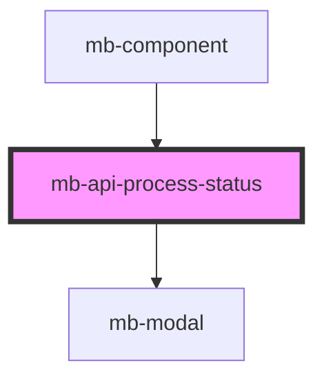

# mb-api-process-status

<!-- Auto Generated Below -->

## Properties

| Property             | Attribute | Description                                                                          | Type                                          | Default     |
| -------------------- | --------- | ------------------------------------------------------------------------------------ | --------------------------------------------- | ----------- |
| `state`              | `state`   | State value of API processing received from parent element ('loading' or 'success'). | `"ERROR" \| "LOADING" \| "NONE" \| "SUCCESS"` | `undefined` |
| `translationService` | --        | Instance of TranslationService passed from parent component.                         | `TranslationService`                          | `undefined` |
| `visible`            | `visible` | Element visibility, default is 'false'.                                              | `boolean`                                     | `false`     |

## Events

| Event            | Description                                 | Type                |
| ---------------- | ------------------------------------------- | ------------------- |
| `closeFromStart` | Emitted when user clicks on 'x' button.     | `CustomEvent<void>` |
| `closeTryAgain`  | Emitted when user clicks on 'Retry' button. | `CustomEvent<void>` |

## Shadow Parts

| Part                      | Description |
| ------------------------- | ----------- |
| `"mb-api-process-status"` |             |

## Dependencies

### Used by

 - [mb-component](../mb-component)

### Depends on

- [mb-modal](../mb-modal)

### Graph

----------------------------------------------

*Built with [StencilJS](https://stenciljs.com/)*
