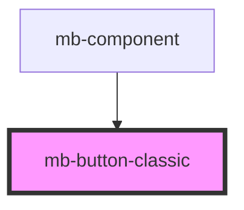

# mb-button-classic

<!-- Auto Generated Below -->

## Properties

| Property         | Attribute         | Description                                                                              | Type      | Default |
| ---------------- | ----------------- | ---------------------------------------------------------------------------------------- | --------- | ------- |
| `disabled`       | `disabled`        | Set to 'true' if button should be disabled, and if click events should not be triggered. | `boolean` | `false` |
| `preventDefault` | `prevent-default` | Set to 'true' if default event should be prevented.                                      | `boolean` | `false` |

## Events

| Event         | Description                                                                                                           | Type                   |
| ------------- | --------------------------------------------------------------------------------------------------------------------- | ---------------------- |
| `buttonClick` | Event which is triggered when user clicks on button element. This event is not triggered when the button is disabled. | `CustomEvent<UIEvent>` |

## Shadow Parts

| Part                  | Description |
| --------------------- | ----------- |
| `"mb-button-classic"` |             |

## Dependencies

### Used by

 - [mb-component](../mb-component)

### Graph

----------------------------------------------

*Built with [StencilJS](https://stenciljs.com/)*
