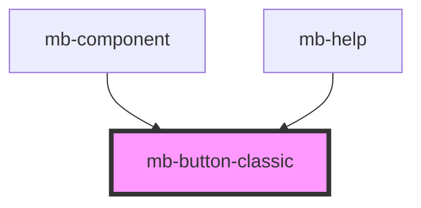

# mb-button-classic

<!-- Auto Generated Below -->

## Properties

| Property                    | Attribute         | Description                                                                              | Type                    | Default     |
| --------------------------- | ----------------- | ---------------------------------------------------------------------------------------- | ----------------------- | ----------- |
| `clickHandler` _(required)_ | --                | Function to call on click                                                                | `(ev: UIEvent) => void` | `undefined` |
| `disabled`                  | `disabled`        | Set to 'true' if button should be disabled, and if click events should not be triggered. | `boolean`               | `false`     |
| `inverted`                  | `inverted`        | Set to 'true' if button should be inverted style.                                        | `boolean`               | `false`     |
| `preventDefault`            | `prevent-default` | Set to 'true' if default event should be prevented.                                      | `boolean`               | `false`     |
| `quit`                      | `quit`            |                                                                                          | `boolean`               | `undefined` |

## Shadow Parts

| Part       | Description |
| ---------- | ----------- |
| `"button"` |             |

## Dependencies

### Used by

 - [mb-component](../mb-component)
 - [mb-help](../mb-help)

### Graph

----------------------------------------------

*Built with [StencilJS](https://stenciljs.com/)*
