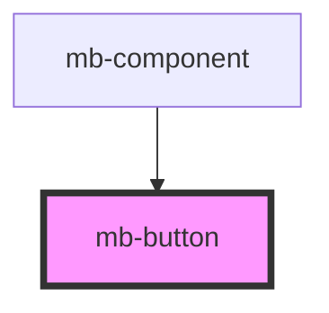

# mb-button

<!-- Auto Generated Below -->

## Properties

| Property                       | Attribute           | Description                                                                              | Type                    | Default     |
| ------------------------------ | ------------------- | ---------------------------------------------------------------------------------------- | ----------------------- | ----------- |
| `buttonTitle` _(required)_     | `button-title`      |                                                                                          | `string`                | `undefined` |
| `clickHandler` _(required)_    | --                  | Function to call on click                                                                | `(ev: UIEvent) => void` | `undefined` |
| `disabled`                     | `disabled`          | Set to 'true' if button should be disabled, and if click events should not be triggered. | `boolean`               | `false`     |
| `imageAlt`                     | `image-alt`         | Passed description text for image element from parent component.                         | `string`                | `''`        |
| `imageSrcActive` _(required)_  | `image-src-active`  | Passed image from parent component.                                                      | `string`                | `undefined` |
| `imageSrcDefault` _(required)_ | `image-src-default` | Passed image from parent component.                                                      | `string`                | `undefined` |
| `label`                        | `label`             | Set to string which should be displayed below the icon.  If omitted, nothing will show.  | `string`                | `''`        |
| `selected`                     | `selected`          | Set to 'true' if button should enter 'selected' state.                                   | `boolean`               | `false`     |
| `visible`                      | `visible`           | Set to 'true' if button should be visible.                                               | `boolean`               | `false`     |

## Dependencies

### Used by

 - [mb-component](../mb-component)

### Graph

----------------------------------------------

*Built with [StencilJS](https://stenciljs.com/)*
