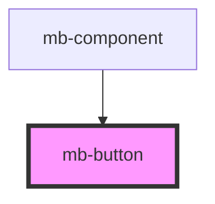

# mb-button

<!-- Auto Generated Below -->

## Properties

| Property             | Attribute           | Description                                                                              | Type                 | Default     |
| -------------------- | ------------------- | ---------------------------------------------------------------------------------------- | -------------------- | ----------- |
| `disabled`           | `disabled`          | Set to 'true' if button should be disabled, and if click events should not be triggered. | `boolean`            | `false`     |
| `icon`               | `icon`              | Set to 'true' if button contains an icon.                                                | `boolean`            | `false`     |
| `imageAlt`           | `image-alt`         | Passed description text for image element from parent component.                         | `string`             | `''`        |
| `imageSrcActive`     | `image-src-active`  | Passed image from parent component.                                                      | `string`             | `''`        |
| `imageSrcDefault`    | `image-src-default` | Passed image from parent component.                                                      | `string`             | `''`        |
| `label`              | `label`             | Set to string which should be displayed below the icon.  If omitted, nothing will show.  | `string`             | `''`        |
| `preventDefault`     | `prevent-default`   | Set to 'true' if default event should be prevented.                                      | `boolean`            | `false`     |
| `selected`           | `selected`          | Set to 'true' if button should enter 'selected' state.                                   | `boolean`            | `false`     |
| `translationService` | --                  | Instance of TranslationService passed from root component.                               | `TranslationService` | `undefined` |
| `visible`            | `visible`           | Set to 'true' if button should be visible.                                               | `boolean`            | `false`     |

## Events

| Event         | Description                                                                                                           | Type                   |
| ------------- | --------------------------------------------------------------------------------------------------------------------- | ---------------------- |
| `buttonClick` | Event which is triggered when user clicks on button element. This event is not triggered when the button is disabled. | `CustomEvent<UIEvent>` |

## Shadow Parts

| Part          | Description |
| ------------- | ----------- |
| `"mb-button"` |             |

## Dependencies

### Used by

 - [mb-component](../mb-component)

### Graph

----------------------------------------------

*Built with [StencilJS](https://stenciljs.com/)*
