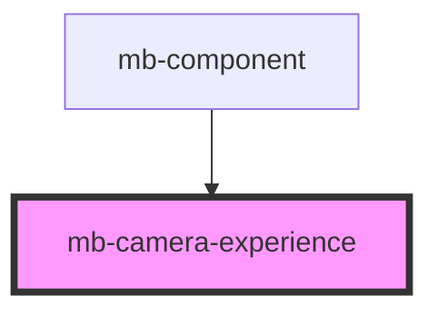

# mb-camera-experience

<!-- Auto Generated Below -->

## Properties

| Property             | Attribute        | Description                                                                                                                                                 | Type                                                                                           | Default     |
| -------------------- | ---------------- | ----------------------------------------------------------------------------------------------------------------------------------------------------------- | ---------------------------------------------------------------------------------------------- | ----------- |
| `apiState`           | `api-state`      | Api state passed from root component.                                                                                                                       | `string`                                                                                       | `undefined` |
| `cameraFlipped`      | `camera-flipped` | Camera horizontal state passed from root component.  Horizontal camera image can be mirrored                                                                | `boolean`                                                                                      | `false`     |
| `showOverlay`        | `show-overlay`   | Unless specifically granted by your license key, you are not allowed to modify or remove the Microblink logo displayed on the bottom of the camera overlay. | `boolean`                                                                                      | `true`      |
| `translationService` | --               | Instance of TranslationService passed from root component.                                                                                                  | `TranslationService`                                                                           | `undefined` |
| `type`               | `type`           | Choose desired camera experience.  Each experience type must be implemented in this component.                                                              | `CameraExperience.Barcode \| CameraExperience.CardCombined \| CameraExperience.CardSingleSide` | `undefined` |

## Events

| Event              | Description                              | Type                |
| ------------------ | ---------------------------------------- | ------------------- |
| `close`            | Emitted when user clicks on 'X' button.  | `CustomEvent<void>` |
| `flipCameraAction` | Emitted when user clicks on Flip button. | `CustomEvent<void>` |

## Methods

### `setCameraFlipState(isFlipped: boolean) => Promise<void>`

Method is exposed outside which allow us to control Camera Flip state from parent component.

#### Returns

Type: `Promise<void>`

### `setState(state: CameraExperienceState, isBackSide?: boolean, force?: boolean) => Promise<void>`

Set camera scanning state.

#### Returns

Type: `Promise<void>`

## Dependencies

### Used by

 - [mb-component](../mb-component)

### Graph

----------------------------------------------

*Built with [StencilJS](https://stenciljs.com/)*
