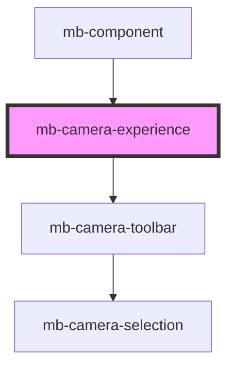

# mb-camera-experience

<!-- Auto Generated Below -->

## Properties

| Property                           | Attribute                              | Description                                                                                                                                                 | Type                                                                                                                           | Default     |
| ---------------------------------- | -------------------------------------- | ----------------------------------------------------------------------------------------------------------------------------------------------------------- | ------------------------------------------------------------------------------------------------------------------------------ | ----------- |
| `apiState`                         | `api-state`                            | Api state passed from root component.                                                                                                                       | `string`                                                                                                                       | `undefined` |
| `cameraFlipped`                    | `camera-flipped`                       | Camera horizontal state passed from root component.  Horizontal camera image can be mirrored                                                                | `boolean`                                                                                                                      | `false`     |
| `showCameraFeedbackBarcodeMessage` | `show-camera-feedback-barcode-message` | Show camera feedback message on camera for Barcode scanning                                                                                                 | `boolean`                                                                                                                      | `false`     |
| `showOverlay`                      | `show-overlay`                         | Unless specifically granted by your license key, you are not allowed to modify or remove the Microblink logo displayed on the bottom of the camera overlay. | `boolean`                                                                                                                      | `true`      |
| `showScanningLine`                 | `show-scanning-line`                   | Show scanning line on camera                                                                                                                                | `boolean`                                                                                                                      | `false`     |
| `translationService`               | --                                     | Instance of TranslationService passed from root component.                                                                                                  | `TranslationService`                                                                                                           | `undefined` |
| `type`                             | `type`                                 | Choose desired camera experience.  Each experience type must be implemented in this component.                                                              | `CameraExperience.Barcode \| CameraExperience.CardCombined \| CameraExperience.CardSingleSide \| CameraExperience.PaymentCard` | `undefined` |

## Events

| Event                | Description                                          | Type                       |
| -------------------- | ---------------------------------------------------- | -------------------------- |
| `changeCameraDevice` | Emitted when user selects a different camera device. | `CustomEvent<CameraEntry>` |
| `close`              | Emitted when user clicks on 'X' button.              | `CustomEvent<void>`        |
| `flipCameraAction`   | Emitted when user clicks on Flip button.             | `CustomEvent<void>`        |

## Methods

### `populateCameraDevices() => Promise<void>`

Populate list of camera devices.

#### Returns

Type: `Promise<void>`

### `resetState() => Promise<void>`

#### Returns

Type: `Promise<void>`

### `setActiveCamera(cameraId: string) => Promise<void>`

Change active camera.

#### Returns

Type: `Promise<void>`

### `setCameraFlipState(isFlipped: boolean) => Promise<void>`

Method is exposed outside which allow us to control Camera Flip state from parent component.

#### Returns

Type: `Promise<void>`

### `setState(state: CameraExperienceState, isBackSide?: boolean, force?: boolean) => Promise<void>`

#### Returns

Type: `Promise<void>`

## Dependencies

### Used by

 - [mb-component](../mb-component)

### Depends on

- [mb-camera-toolbar](../mb-camera-toolbar)

### Graph

----------------------------------------------

*Built with [StencilJS](https://stenciljs.com/)*
