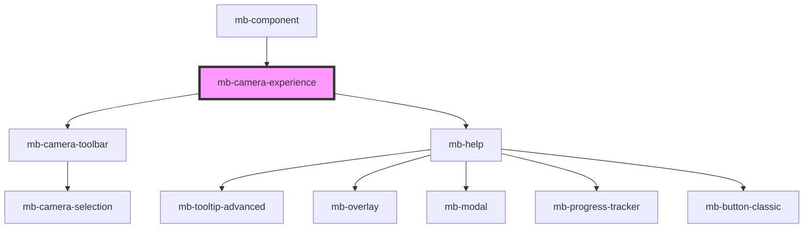

# mb-camera-experience

<!-- Auto Generated Below -->

## Properties

| Property                               | Attribute                                  | Description                                                                                                                                                 | Type                                                                                                                            | Default     |
| -------------------------------------- | ------------------------------------------ | ----------------------------------------------------------------------------------------------------------------------------------------------------------- | ------------------------------------------------------------------------------------------------------------------------------- | ----------- |
| `allowHelpScreens`                     | `allow-help-screens`                       | Dictates if Help Screens usage is allowed (turned on).                                                                                                      | `boolean`                                                                                                                       | `false`     |
| `allowHelpScreensFab`                  | `allow-help-screens-fab`                   | See description in public component.                                                                                                                        | `boolean`                                                                                                                       | `false`     |
| `allowHelpScreensOnboarding`           | `allow-help-screens-onboarding`            | See description in public component.                                                                                                                        | `boolean`                                                                                                                       | `false`     |
| `allowHelpScreensOnboardingPerpetuity` | `allow-help-screens-onboarding-perpetuity` | See description in public component.                                                                                                                        | `boolean`                                                                                                                       | `false`     |
| `apiState`                             | `api-state`                                | Api state passed from root component.                                                                                                                       | `string`                                                                                                                        | `undefined` |
| `cameraExperienceStateDurations`       | --                                         | Configure camera experience state timeout durations                                                                                                         | `CameraExperienceTimeoutDurations`                                                                                              | `null`      |
| `cameraFlipped`                        | `camera-flipped`                           | Camera horizontal state passed from root component.  Horizontal camera image can be mirrored                                                                | `boolean`                                                                                                                       | `false`     |
| `clearIsCameraActive`                  | `clear-is-camera-active`                   |                                                                                                                                                             | `boolean`                                                                                                                       | `false`     |
| `helpScreensTooltipPauseTimeout`       | `help-screens-tooltip-pause-timeout`       | See description in public component.                                                                                                                        | `number`                                                                                                                        | `15000`     |
| `showCameraFeedbackBarcodeMessage`     | `show-camera-feedback-barcode-message`     | Show camera feedback message on camera for Barcode scanning                                                                                                 | `boolean`                                                                                                                       | `false`     |
| `showOverlay`                          | `show-overlay`                             | Unless specifically granted by your license key, you are not allowed to modify or remove the Microblink logo displayed on the bottom of the camera overlay. | `boolean`                                                                                                                       | `true`      |
| `showScanningLine`                     | `show-scanning-line`                       | Show scanning line on camera                                                                                                                                | `boolean`                                                                                                                       | `false`     |
| `translationService`                   | --                                         | Instance of TranslationService passed from root component.                                                                                                  | `TranslationService`                                                                                                            | `undefined` |
| `type`                                 | `type`                                     | Choose desired camera experience.  Each experience type must be implemented in this component.                                                              | `CameraExperience.Barcode \| CameraExperience.CardMultiSide \| CameraExperience.CardSingleSide \| CameraExperience.PaymentCard` | `undefined` |

## Events

| Event                | Description                                          | Type                       |
| -------------------- | ---------------------------------------------------- | -------------------------- |
| `changeCameraDevice` | Emitted when user selects a different camera device. | `CustomEvent<CameraEntry>` |
| `close`              | Emitted when user clicks on 'X' button.              | `CustomEvent<void>`        |
| `flipCameraAction`   | Emitted when user clicks on Flip button.             | `CustomEvent<void>`        |
| `setIsCameraActive`  | Emitted when camera stream becomes active.           | `CustomEvent<boolean>`     |

## Methods

### `initializeHelpScreens(callbacks: MbHelpCallbacks) => Promise<void>`

Initializes Help Screens.

#### Returns

Type: `Promise<void>`

### `openHelpScreensOnboarding() => Promise<void>`

Opens Help Screens in the Onboarding mode.

#### Returns

Type: `Promise<void>`

### `populateCameraDevices() => Promise<void>`

Populate list of camera devices.

#### Returns

Type: `Promise<void>`

### `resetState() => Promise<void>`

Set camera state to initial method.

#### Returns

Type: `Promise<void>`

### `setActiveCamera(cameraId: string) => Promise<void>`

Change active camera.

#### Returns

Type: `Promise<void>`

### `setCameraFlipState(isFlipped: boolean) => Promise<void>`

Method is exposed outside which allow us to control Camera Flip state from parent component.

#### Returns

Type: `Promise<void>`

### `setState(state: CameraExperienceState, isBackSide?: boolean, force?: boolean) => Promise<void>`

Set camera state which includes animation and message.

#### Returns

Type: `Promise<void>`

### `terminateHelpScreens() => Promise<void>`

Terminates Help Screens.

#### Returns

Type: `Promise<void>`

## Dependencies

### Used by

 - [mb-component](../mb-component)

### Depends on

- [mb-camera-toolbar](../mb-camera-toolbar)
- [mb-help](../mb-help)

### Graph

----------------------------------------------

*Built with [StencilJS](https://stenciljs.com/)*
