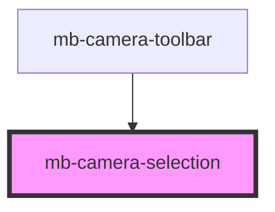

# mb-camera-selection

<!-- Auto Generated Below -->

## Properties

| Property              | Attribute                | Description | Type      | Default |
| --------------------- | ------------------------ | ----------- | --------- | ------- |
| `clearIsCameraActive` | `clear-is-camera-active` |             | `boolean` | `false` |

## Events

| Event                | Description                                          | Type                       |
| -------------------- | ---------------------------------------------------- | -------------------------- |
| `changeCameraDevice` | Emitted when user selects a different camera device. | `CustomEvent<CameraEntry>` |
| `setIsCameraActive`  | Emitted when camera stream becomes active.           | `CustomEvent<boolean>`     |

## Methods

### `populateCameraDevices() => Promise<void>`

Populate list of camera devices.

#### Returns

Type: `Promise<void>`

### `setActiveCamera(cameraId: string) => Promise<void>`

Change active camera.

#### Returns

Type: `Promise<void>`

## Dependencies

### Used by

 - [mb-camera-toolbar](../mb-camera-toolbar)

### Graph

----------------------------------------------

*Built with [StencilJS](https://stenciljs.com/)*
