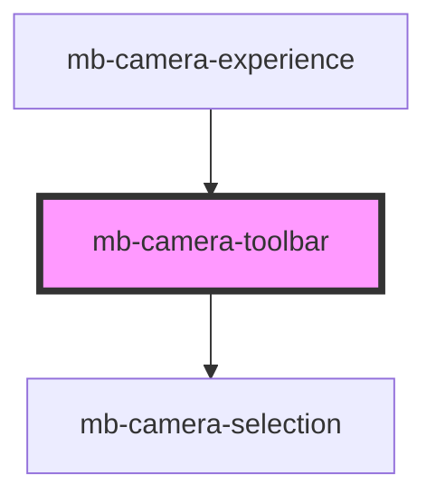

# mb-camera-toolbar

<!-- Auto Generated Below -->

## Properties

| Property           | Attribute            | Description                                                                  | Type      | Default |
| ------------------ | -------------------- | ---------------------------------------------------------------------------- | --------- | ------- |
| `cameraFlipped`    | `camera-flipped`     | Whether the camera is flipped, this property will be flip the relevant icon. | `boolean` | `false` |
| `enableCameraFlip` | `enable-camera-flip` | Whether to show 'Camera flip' button.                                        | `boolean` | `false` |
| `showClose`        | `show-close`         | Set to `true` if close button should be displayed.                           | `boolean` | `false` |

## Events

| Event                | Description                                                  | Type                       |
| -------------------- | ------------------------------------------------------------ | -------------------------- |
| `changeCameraDevice` | Emitted when user selects a different camera device.         | `CustomEvent<CameraEntry>` |
| `closeEvent`         | Event which is triggered when close button is clicked.       | `CustomEvent<void>`        |
| `flipEvent`          | Event which is triggered when flip camera button is clicked. | `CustomEvent<void>`        |

## Methods

### `populateCameraDevices() => Promise<void>`

Populate list of camera devices.

#### Returns

Type: `Promise<void>`

### `setActiveCamera(cameraId: string) => Promise<void>`

Change active camera.

#### Returns

Type: `Promise<void>`

## Shadow Parts

| Part                  | Description |
| --------------------- | ----------- |
| `"mb-camera-toolbar"` |             |

## Dependencies

### Used by

 - [mb-camera-experience](../mb-camera-experience)

### Depends on

- [mb-camera-selection](../mb-camera-selection)

### Graph

----------------------------------------------

*Built with [StencilJS](https://stenciljs.com/)*
