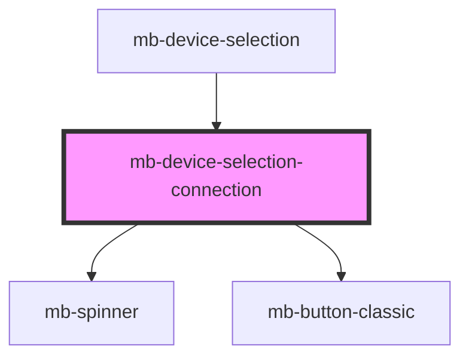

# mb-device-selection-connection

<!-- Auto Generated Below -->

## Properties

| Property  | Attribute | Description | Type     | Default     |
| --------- | --------- | ----------- | -------- | ----------- |
| `variant` | `variant` |             | `string` | `undefined` |

## Events

| Event   | Description | Type                |
| ------- | ----------- | ------------------- |
| `close` |             | `CustomEvent<void>` |

## Dependencies

### Used by

 - [mb-device-selection](..)

### Depends on

- [mb-spinner](../../mb-spinner)
- [mb-button-classic](../../mb-button-classic)

### Graph

----------------------------------------------

*Built with [StencilJS](https://stenciljs.com/)*
