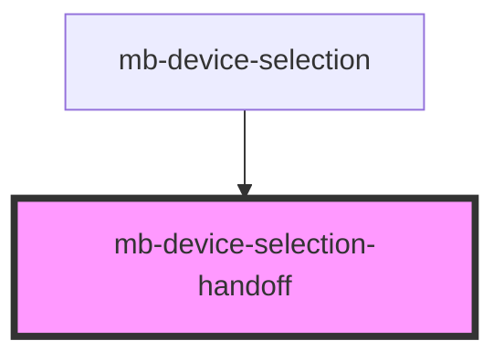

# mb-device-selection-handoff

<!-- Auto Generated Below -->

## Properties

| Property     | Attribute | Description | Type                         | Default     |
| ------------ | --------- | ----------- | ---------------------------- | ----------- |
| `urlFactory` | --        |             | `(peerId: string) => string` | `undefined` |

## Dependencies

### Used by

 - [mb-device-selection](..)

### Graph

----------------------------------------------

*Built with [StencilJS](https://stenciljs.com/)*
