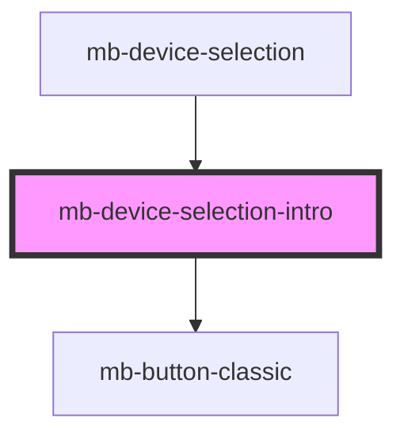

# mb-device-selection-intro

<!-- Auto Generated Below -->

## Properties

| Property     | Attribute | Description | Type         | Default     |
| ------------ | --------- | ----------- | ------------ | ----------- |
| `d2dOptions` | --        |             | `D2DOptions` | `undefined` |

## Events

| Event  | Description | Type                            |
| ------ | ----------- | ------------------------------- |
| `done` |             | `CustomEvent<RecognitionEvent>` |

## Dependencies

### Used by

 - [mb-device-selection](..)

### Depends on

- [mb-button-classic](../../mb-button-classic)

### Graph

----------------------------------------------

*Built with [StencilJS](https://stenciljs.com/)*
