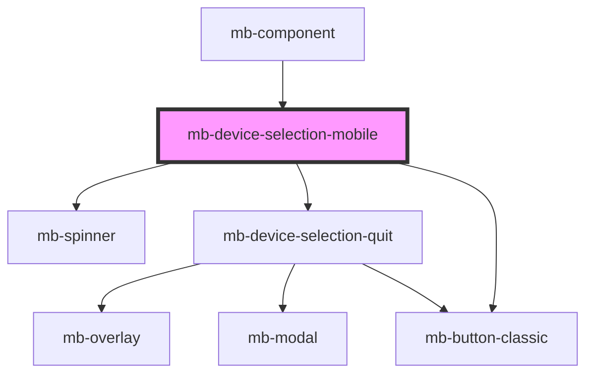

# mb-device-selection-mobile

<!-- Auto Generated Below -->

## Properties

| Property     | Attribute | Description | Type         | Default     |
| ------------ | --------- | ----------- | ------------ | ----------- |
| `d2dOptions` | --        |             | `D2DOptions` | `undefined` |

## Events

| Event  | Description | Type                |
| ------ | ----------- | ------------------- |
| `init` |             | `CustomEvent<void>` |

## Dependencies

### Used by

 - [mb-component](../../mb-component)

### Depends on

- [mb-spinner](../../mb-spinner)
- [mb-device-selection-quit](../mb-device-selection-quit)
- [mb-button-classic](../../mb-button-classic)

### Graph

----------------------------------------------

*Built with [StencilJS](https://stenciljs.com/)*
