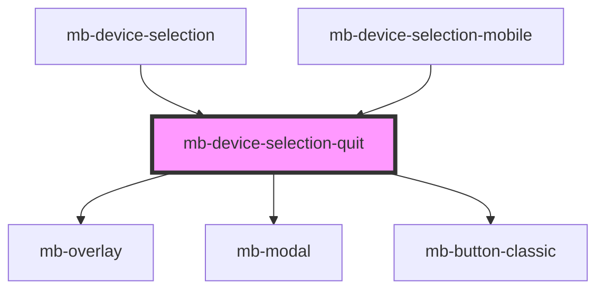

# mb-device-selection-quit

<!-- Auto Generated Below -->

## Properties

| Property       | Attribute       | Description | Type      | Default     |
| -------------- | --------------- | ----------- | --------- | ----------- |
| `confirmLabel` | `confirm-label` |             | `string`  | `''`        |
| `denyLabel`    | `deny-label`    |             | `string`  | `''`        |
| `description`  | `description`   |             | `string`  | `undefined` |
| `modalLabel`   | `modal-label`   |             | `string`  | `''`        |
| `visible`      | `visible`       |             | `boolean` | `false`     |

## Events

| Event     | Description | Type                |
| --------- | ----------- | ------------------- |
| `cancel`  |             | `CustomEvent<void>` |
| `confirm` |             | `CustomEvent<void>` |

## Dependencies

### Used by

 - [mb-device-selection](..)
 - [mb-device-selection-mobile](../mb-device-selection-mobile)

### Depends on

- [mb-overlay](../../mb-overlay)
- [mb-modal](../../mb-modal)
- [mb-button-classic](../../mb-button-classic)

### Graph

----------------------------------------------

*Built with [StencilJS](https://stenciljs.com/)*
