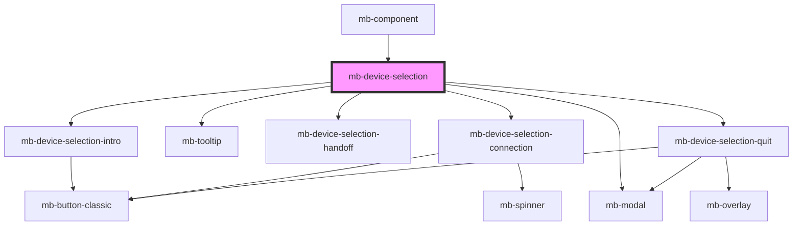

# mb-device-selection

<!-- Auto Generated Below -->

## Properties

| Property     | Attribute | Description | Type         | Default     |
| ------------ | --------- | ----------- | ------------ | ----------- |
| `d2dOptions` | --        |             | `D2DOptions` | `undefined` |

## Events

| Event   | Description | Type                            |
| ------- | ----------- | ------------------------------- |
| `close` | Close event | `CustomEvent<void>`             |
| `done`  |             | `CustomEvent<RecognitionEvent>` |
| `init`  |             | `CustomEvent<void>`             |

## Methods

### `closeModal() => Promise<void>`

#### Returns

Type: `Promise<void>`

## Dependencies

### Used by

 - [mb-component](../mb-component)

### Depends on

- [mb-device-selection-intro](mb-device-selection-intro)
- [mb-tooltip](../mb-tooltip)
- [mb-device-selection-handoff](mb-device-selection-handoff)
- [mb-device-selection-connection](mb-device-selection-connection)
- [mb-modal](../mb-modal)
- [mb-device-selection-quit](mb-device-selection-quit)

### Graph

----------------------------------------------

*Built with [StencilJS](https://stenciljs.com/)*
