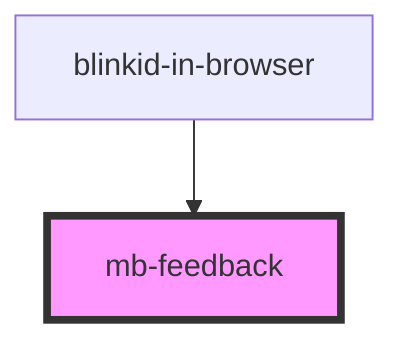

# mb-feedback

<!-- Auto Generated Below -->

## Properties

| Property  | Attribute | Description                                   | Type      | Default |
| --------- | --------- | --------------------------------------------- | --------- | ------- |
| `visible` | `visible` | Set to 'true' if component should be visible. | `boolean` | `false` |

## Methods

### `show(feedback: FeedbackMessage) => Promise<void>`

Call when FeedbackMessage which should be displayed.

#### Returns

Type: `Promise<void>`

## Shadow Parts

| Part            | Description |
| --------------- | ----------- |
| `"mb-feedback"` |             |

## Dependencies

### Used by

 - [blinkid-in-browser](../../blinkid-in-browser)

### Graph

----------------------------------------------

*Built with [StencilJS](https://stenciljs.com/)*
