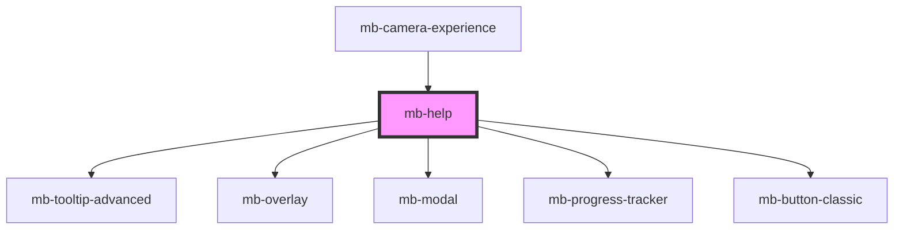

# mb-help

<!-- Auto Generated Below -->

## Properties

| Property                          | Attribute                     | Description                                                             | Type                 | Default                                        |
| --------------------------------- | ----------------------------- | ----------------------------------------------------------------------- | -------------------- | ---------------------------------------------- |
| `allow`                           | `allow`                       | Dictates if usage is allowed (turned on).                               | `boolean`            | `DEFEAULT_MB_HELP_ALLOW`                       |
| `allowFab`                        | `allow-fab`                   | Dictates if Floating-Action-Button (Fab) is shown.                      | `boolean`            | `DEFEAULT_MB_HELP_ALLOW_LOBBY`                 |
| `allowOnboarding`                 | `allow-onboarding`            | Dictates if the onboarding is allowed.                                  | `boolean`            | `DEFEAULT_MB_HELP_ALLOW_ONBOARDING`            |
| `allowOnboardingPerpetuity`       | `allow-onboarding-perpetuity` | Dictates if onboarding is executed all the time, or just once.          | `boolean`            | `DEFEAULT_MB_HELP_ALLOW_ONBOARDING_PERPETUITY` |
| `tooltipPauseTimeout`             | `tooltip-pause-timeout`       | Dictates Milliseconds after which a "Need Help?" tooltip will be shown. | `number`             | `DEFAULT_MB_HELP_TOOLTOP_PAUSE_TIMEOUT_MS`     |
| `translationService` _(required)_ | --                            | Translation service.                                                    | `TranslationService` | `undefined`                                    |

## Methods

### `close() => Promise<void>`

Closes modal.

#### Returns

Type: `Promise<void>`

### `initialize(callbacks: MbHelpCallbacks) => Promise<void>`

Initializes - starts tooltip timer, etc.

#### Returns

Type: `Promise<void>`

### `openHelpScreens() => Promise<void>`

Opens modal for Help Screens purpose.

#### Returns

Type: `Promise<void>`

### `openOnboarding() => Promise<void>`

Opens modal for Onboarding purpose.

#### Returns

Type: `Promise<void>`

### `terminate() => Promise<void>`

Terminates - cancels tooltip timer, closes modal, etc.

#### Returns

Type: `Promise<void>`

## Dependencies

### Used by

 - [mb-camera-experience](../mb-camera-experience)

### Depends on

- [mb-tooltip-advanced](../mb-tooltip-advanced)
- [mb-overlay](../mb-overlay)
- [mb-modal](../mb-modal)
- [mb-progress-tracker](../mb-progress-tracker)
- [mb-button-classic](../mb-button-classic)

### Graph

----------------------------------------------

*Built with [StencilJS](https://stenciljs.com/)*
