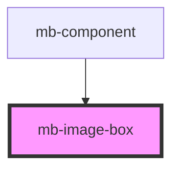

# mb-image-box

<!-- Auto Generated Below -->

## Properties

| Property     | Attribute     | Description                                                                                 | Type     | Default     |
| ------------ | ------------- | ------------------------------------------------------------------------------------------- | -------- | ----------- |
| `anchorText` | `anchor-text` | Text which should be displayed inside 'Add image' anchor element when file is not selected. | `string` | `undefined` |
| `boxTitle`   | `box-title`   | Text which represents name of the image.                                                    | `string` | `undefined` |

## Events

| Event         | Description                                                   | Type                    |
| ------------- | ------------------------------------------------------------- | ----------------------- |
| `imageChange` | Event which is triggered when selected image file is changed. | `CustomEvent<FileList>` |

## Methods

### `clear() => Promise<void>`

Clear input image.

#### Returns

Type: `Promise<void>`

## Shadow Parts

| Part             | Description |
| ---------------- | ----------- |
| `"mb-image-box"` |             |

## Dependencies

### Used by

 - [mb-component](../mb-component)

### Graph

----------------------------------------------

*Built with [StencilJS](https://stenciljs.com/)*
