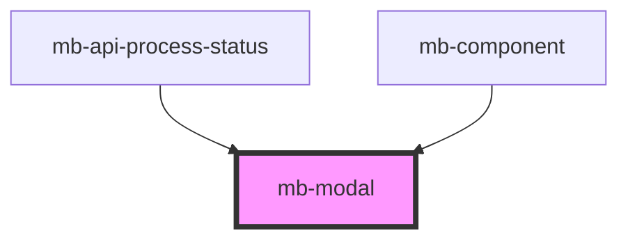

# mb-modal

<!-- Auto Generated Below -->

## Properties

| Property          | Attribute          | Description                                | Type      | Default |
| ----------------- | ------------------ | ------------------------------------------ | --------- | ------- |
| `centered`        | `centered`         | Center component                           | `boolean` | `false` |
| `content`         | `content`          | Passed body content from parent component  | `string`  | `""`    |
| `contentCentered` | `content-centered` | Center content inside modal                | `boolean` | `true`  |
| `elevated`        | `elevated`         | Show shadow drop                           | `boolean` | `false` |
| `hideFooter`      | `hide-footer`      | Whether to hide the footer or not          | `boolean` | `false` |
| `modalTitle`      | `modal-title`      | Passed title content from parent component | `string`  | `""`    |
| `showBackButton`  | `show-back-button` | Whether to show back arrow or not          | `boolean` | `false` |
| `visible`         | `visible`          | Show modal content                         | `boolean` | `false` |

## Events

| Event   | Description                                      | Type                |
| ------- | ------------------------------------------------ | ------------------- |
| `back`  | Emitted when user clicks on 'Back Arrow' button. | `CustomEvent<void>` |
| `close` | Emitted when user clicks on 'X' button.          | `CustomEvent<void>` |

## Shadow Parts

| Part               | Description |
| ------------------ | ----------- |
| `"mb-modal"`       |             |
| `"mb-modal-inner"` |             |

## Dependencies

### Used by

 - [mb-api-process-status](../mb-api-process-status)
 - [mb-component](../mb-component)

### Graph

----------------------------------------------

*Built with [StencilJS](https://stenciljs.com/)*
