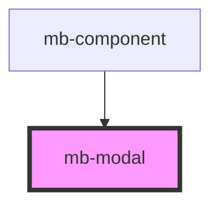

# mb-modal

<!-- Auto Generated Below -->

## Properties

| Property  | Attribute | Description                          | Type           | Default     |
| --------- | --------- | ------------------------------------ | -------------- | ----------- |
| `content` | --        | Passed content from parent component | `ModalContent` | `undefined` |

## Events

| Event   | Description                                 | Type                |
| ------- | ------------------------------------------- | ------------------- |
| `close` | Emitted when user clicks on 'Close' button. | `CustomEvent<void>` |

## Dependencies

### Used by

 - [mb-component](../mb-component)

### Graph

----------------------------------------------

*Built with [StencilJS](https://stenciljs.com/)*
