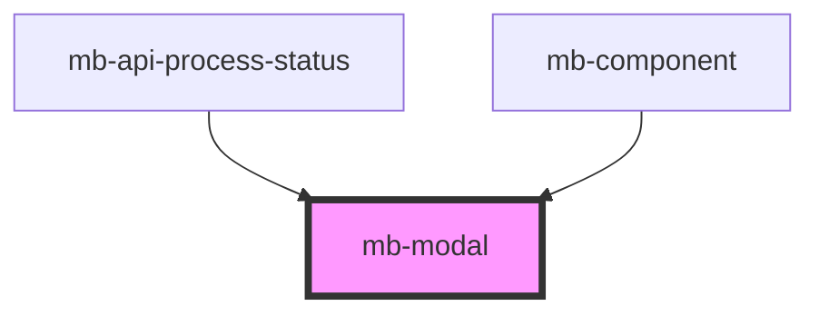

# mb-modal

<!-- Auto Generated Below -->

## Properties

| Property          | Attribute          | Description                                | Type      | Default |
| ----------------- | ------------------ | ------------------------------------------ | --------- | ------- |
| `content`         | `content`          | Passed body content from parent component  | `string`  | `""`    |
| `contentCentered` | `content-centered` | Center content inside modal                | `boolean` | `true`  |
| `modalTitle`      | `modal-title`      | Passed title content from parent component | `string`  | `""`    |
| `visible`         | `visible`          | Show modal content                         | `boolean` | `false` |

## Events

| Event   | Description                             | Type                |
| ------- | --------------------------------------- | ------------------- |
| `close` | Emitted when user clicks on 'X' button. | `CustomEvent<void>` |

## Shadow Parts

| Part         | Description |
| ------------ | ----------- |
| `"mb-modal"` |             |

## Dependencies

### Used by

 - [mb-api-process-status](../mb-api-process-status)
 - [mb-component](../mb-component)

### Graph

----------------------------------------------

*Built with [StencilJS](https://stenciljs.com/)*
