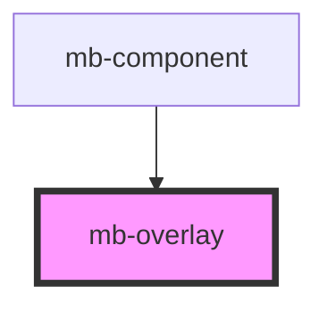

# mb-overlay

<!-- Auto Generated Below -->

## Properties

| Property     | Attribute    | Description                                              | Type      | Default |
| ------------ | ------------ | -------------------------------------------------------- | --------- | ------- |
| `fullscreen` | `fullscreen` | Set to 'false' if overlay should not cover whole screen. | `boolean` | `true`  |
| `visible`    | `visible`    | Set to 'true' if overlay should be visible.              | `boolean` | `false` |

## Shadow Parts

| Part           | Description |
| -------------- | ----------- |
| `"mb-overlay"` |             |

## Dependencies

### Used by

 - [mb-component](../mb-component)

### Graph

----------------------------------------------

*Built with [StencilJS](https://stenciljs.com/)*
