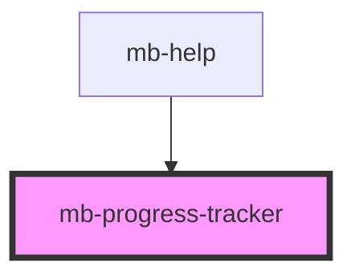

# mb-progress-tracker

<!-- Auto Generated Below -->

## Properties

| Property  | Attribute | Description                                                             | Type     | Default |
| --------- | --------- | ----------------------------------------------------------------------- | -------- | ------- |
| `current` | `current` | Current step.  Steps start from 1 up to the size number.  Default is 1. | `number` | `1`     |
| `size`    | `size`    | Steps count.  Default is 3.                                             | `number` | `3`     |

## Dependencies

### Used by

 - [mb-help](../mb-help)

### Graph

----------------------------------------------

*Built with [StencilJS](https://stenciljs.com/)*
