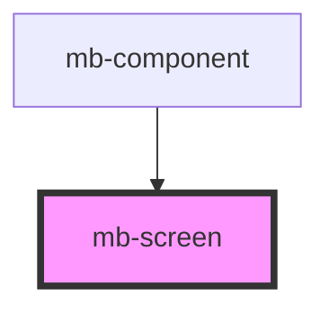

# mb-screen

<!-- Auto Generated Below -->

## Properties

| Property  | Attribute | Description                                | Type      | Default |
| --------- | --------- | ------------------------------------------ | --------- | ------- |
| `visible` | `visible` | Set to 'true' if screen should be visible. | `boolean` | `false` |

## Shadow Parts

| Part          | Description |
| ------------- | ----------- |
| `"mb-screen"` |             |

## Dependencies

### Used by

 - [mb-component](../mb-component)

### Graph

----------------------------------------------

*Built with [StencilJS](https://stenciljs.com/)*
