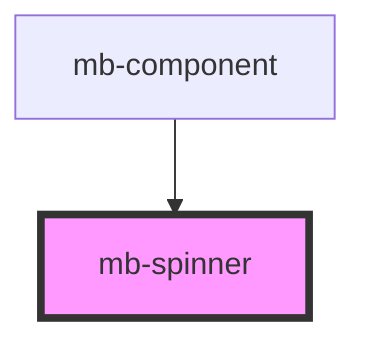

# mb-spinner

<!-- Auto Generated Below -->

## Properties

| Property | Attribute | Description                                 | Type     | Default                                                                                                                                                                                                                                                                                                                                           |
| -------- | --------- | ------------------------------------------- | -------- | ------------------------------------------------------------------------------------------------------------------------------------------------------------------------------------------------------------------------------------------------------------------------------------------------------------------------------------------------- |
| `icon`   | `icon`    | Value of `src` attribute for  element. | `string` | `'data:image/svg+xml;utf8,<svg width="24" height="24" viewBox="0 0 24 24" fill="none" xmlns="http://www.w3.org/2000/svg"><circle opacity="0.33" cx="12" cy="12" r="10" stroke="%2348B2E8" stroke-width="4"/><path d="M2 12C2 6.47715 6.47715 2 12 2" stroke="%2348B2E8" stroke-width="4" stroke-linecap="round" stroke-linejoin="round"/></svg>'` |
| `size`   | `size`    | Spinner size, can be 'default' or 'large'.  | `string` | `'default'`                                                                                                                                                                                                                                                                                                                                       |

## Dependencies

### Used by

 - [mb-component](../mb-component)

### Graph

----------------------------------------------

*Built with [StencilJS](https://stenciljs.com/)*
