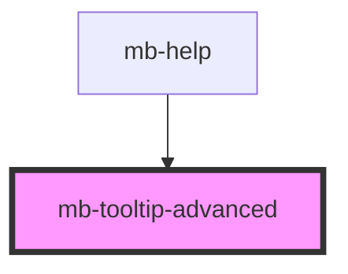

# mb-tooltip-advanced

<!-- Auto Generated Below -->

## Properties

| Property        | Attribute        | Description | Type                                                                                                                                            | Default     |
| --------------- | ---------------- | ----------- | ----------------------------------------------------------------------------------------------------------------------------------------------- | ----------- |
| `arrowPosition` | `arrow-position` |             | `"arrow-down" \| "arrow-down-left" \| "arrow-down-right" \| "arrow-left" \| "arrow-right" \| "arrow-up" \| "arrow-up-left" \| "arrow-up-right"` | `undefined` |
| `message`       | `message`        |             | `string`                                                                                                                                        | `undefined` |
| `show`          | `show`           |             | `boolean`                                                                                                                                       | `undefined` |
| `textAlign`     | `text-align`     |             | `"text-center" \| "text-left" \| "text-right"`                                                                                                  | `undefined` |

## Shadow Parts

| Part        | Description |
| ----------- | ----------- |
| `"tooltip"` |             |

## Dependencies

### Used by

 - [mb-help](../mb-help)

### Graph

----------------------------------------------

*Built with [StencilJS](https://stenciljs.com/)*
