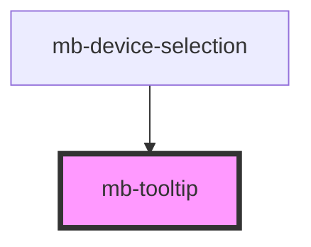

# mb-tooltip

<!-- Auto Generated Below -->

## Properties

| Property          | Attribute           | Description | Type                                                                          | Default     |
| ----------------- | ------------------- | ----------- | ----------------------------------------------------------------------------- | ----------- |
| `arrowPosition`   | `arrow-position`    |             | `"arrow-down" \| "arrow-left" \| "arrow-none" \| "arrow-right" \| "arrow-up"` | `undefined` |
| `containerWidth`  | `container-width`   |             | `string`                                                                      | `undefined` |
| `message`         | `message`           |             | `string`                                                                      | `undefined` |
| `show`            | `show`              |             | `boolean`                                                                     | `undefined` |
| `showInfoIcon`    | `show-info-icon`    |             | `boolean`                                                                     | `undefined` |
| `showWarningIcon` | `show-warning-icon` |             | `boolean`                                                                     | `undefined` |
| `textAlign`       | `text-align`        |             | `"text-center" \| "text-left" \| "text-right"`                                | `undefined` |

## Shadow Parts

| Part        | Description |
| ----------- | ----------- |
| `"tooltip"` |             |

## Dependencies

### Used by

 - [mb-device-selection](../mb-device-selection)

### Graph

----------------------------------------------

*Built with [StencilJS](https://stenciljs.com/)*
